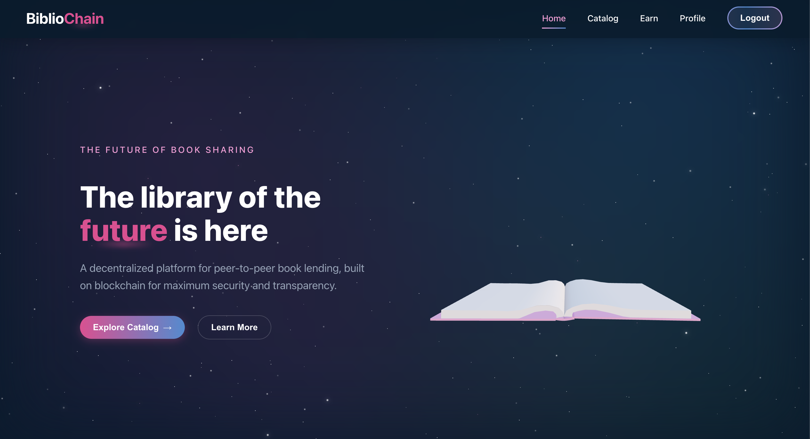
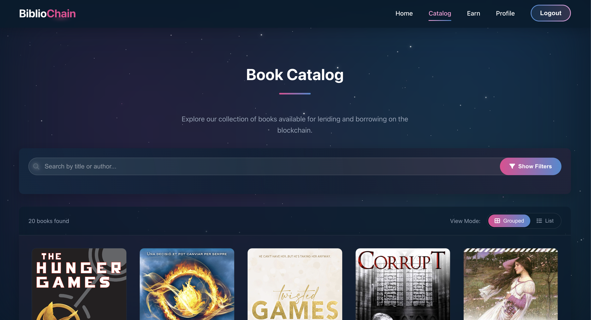
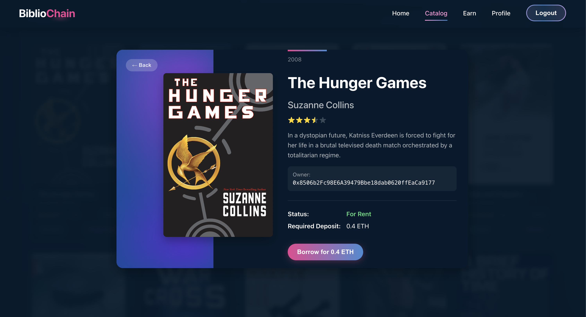
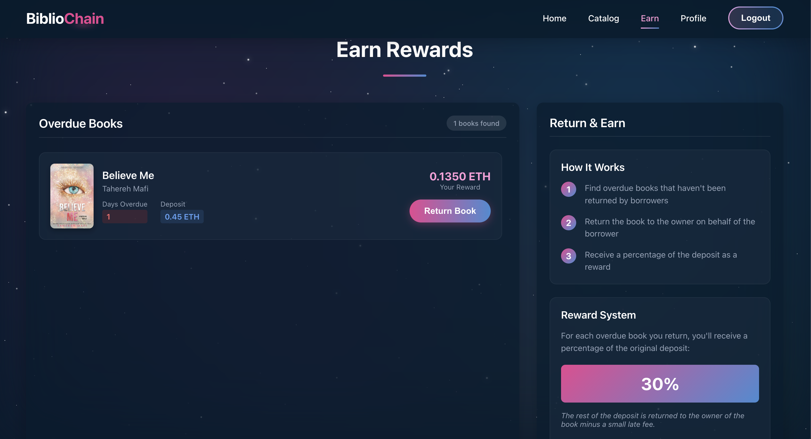
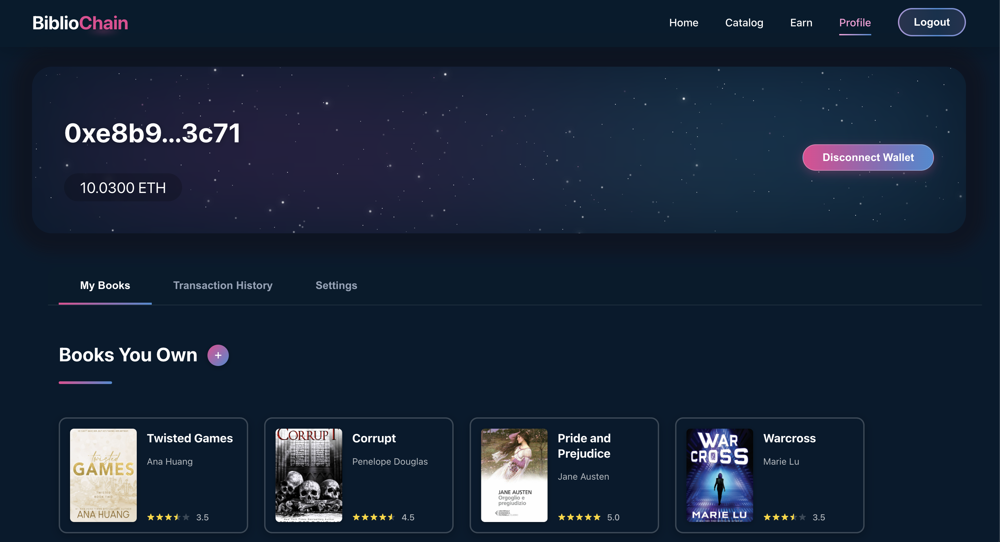
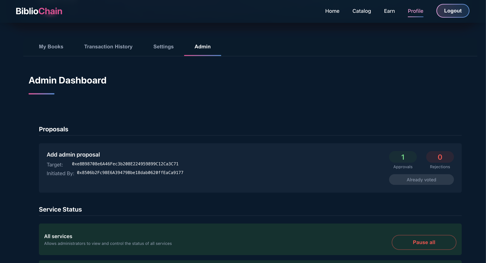
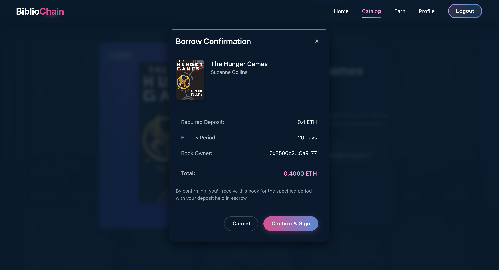

# BiblioChain

A decentralized platform for peer-to-peer book lending and selling, built on blockchain technology for maximum security and transparency.



## Project Overview

BiblioChain is a web application that leverages blockchain technology to create a decentralized library system. Users can:
- Add books to the platform as NFTs (rentable or sellable)
- Borrow books by providing a deposit
- Purchase books directly from other users
- Rate books they've interacted with
- Earn rewards by returning overdue books

The application offers transparency, security, and a trustless environment for book lovers to share and trade their collections.

## Table of Contents

- [Prerequisites](#prerequisites)
- [Installation](#installation)
    - [Frontend](#frontend)
    - [Smart Contracts](#smart-contracts)
- [Configuration](#configuration)
- [Usage](#usage)
- [Project Structure](#project-structure)
- [Development Tools](#development-tools)
- [Documentation](#documentation)
- [Key Features](#key-features)
- [Screenshots](#screenshots)
- [Credits](#credits)
- [License](#license)


## Prerequisites

- Node.js: v23.7.0 or later
- npm: v11.2.0 or later
- A Pinata account for IPFS storage: [https://pinata.cloud/](https://pinata.cloud/)
- MetaMask wallet or WalletConnect compatible wallet
- Sepolia testnet ETH for transactions

## Installation

### Frontend

1. Clone the repository
```bash
git clone https://gitlab-edu.supsi.ch/dti-isin/giuliano.gremlich/opzione-blockchain-engineering/24-25/progetti-studenti/galasso.git
cd galasso/frontend
```

2. Install dependencies
```bash
npm install
```

3. Create a `.env` file in the frontend directory with your Pinata API credentials:
```
VITE_PINATA_API_KEY=your_pinata_api_key
VITE_PINATA_SECRET_API_KEY=your_pinata_secret_key
```

4. Start the development server
```bash
npm run dev
```

5. (Optional) Run Storybook to view UI components
```bash
npm run storybook
```
Then navigate to [http://localhost:6006](http://localhost:6006) in your browser.

### Smart Contracts

1. Navigate to the blockchain directory
```bash
cd galasso/blockchain
```

2. Install dependencies
```bash
npm install --legacy-peer-deps
```

3. Create a `.env` file in the blockchain directory:
```
PRIVATE_KEY=your_wallet_private_key
INFURA_API_KEY=your_infura_project_id
```

4. Compile the smart contracts
```bash
npx hardhat compile
```

5. Run tests (optional)
```bash
npx hardhat test
```

6. Deploy to Sepolia testnet
```bash
npx hardhat run scripts/deploy.ts --network sepolia
```

## Configuration

The application connects to the Sepolia testnet (Chain ID: 11155111). Make sure your wallet is configured to use the Sepolia network.

To interact with the application:
1. Get Sepolia testnet ETH from a faucet
2. Connect your wallet (MetaMask or WalletConnect)

## Usage

1. Connect your wallet to the application
2. Browse available books in the catalog
3. Add your own books to lend or sell
4. Borrow or purchase books from other users
5. Return borrowed books to get your deposit back
6. Rate books you've interacted with
7. Earn rewards by returning overdue books

## Project Structure

- `frontend/` - React frontend application
    - `src/` - Source code
        - `components/` - Reusable UI components
        - `contexts/` - React contexts for state management
        - `hooks/` - Custom React hooks
        - `pages/` - Application pages
        - `services/` - Service classes for API interactions
        - `types/` - TypeScript type definitions
        - `routes/` - Application routing
        - `i18n/` - Internationalization
    - `.storybook/` - Storybook configuration
    - `public/` - Static assets

- `blockchain/` - Smart contracts and blockchain interaction
    - `contracts/` - Solidity smart contracts
    - `scripts/` - Deployment and utility scripts
    - `test/` - Automated tests

- `doc/` - Project documentation
    - `Diagrams/` - Visual diagrams of system processes
    - `Doc/` - Generated frontend documentation
    - `TestReport/` - Test coverage reports

## Development Tools

- **Storybook**: View and interact with UI components in isolation
  ```bash
  npm run storybook
  # Access at http://localhost:6006
  ```

- **TypeScript**: Static type checking for improved code quality
- **React 19**: Latest version of React for building the UI
- **Vite**: Fast development server and build tool
- **React Router**: For application routing
- **Ethers.js**: For blockchain interactions
- **i18next**: Internationalization support
- **Three.js**: For 3D book visuals

## Documentation

The project includes comprehensive documentation:

- **System Diagrams**: Located in `doc/Diagrams/`
    - Book Creation Flow
    - Proposal Creation Process
    - Proposal Voting Process
    - Class Diagrams

- **Code Documentation**: Generated docs available in `doc/Doc/`
    - View by opening `doc/Doc/index.html` in a web browser

- **Test Reports**: Coverage information in `doc/TestReport/`
    - View by opening `doc/TestReport/index.html` in a web browser

## Key Features

- **Multi-step Book Creation**: Add books with detailed metadata, cover images, and lending/selling terms
- **Transparent Transactions**: All lending and purchasing is handled through smart contracts
- **Decentralized Storage**: Book metadata and images stored on IPFS via Pinata
- **Reward System**: Earn ETH by returning overdue books
- **Rating System**: Rate books after interactions
- **Admin Controls**: Platform governance with multi-signature proposals
- **Responsive Design**: Works on desktop and mobile devices

## Screenshots


*The BiblioChain home page featuring the hero section*


*Browse all available books with filtering options*


*Detailed view of a book with lending/purchase options*


*Earn section to return overdue books*


*User profile showing owned and borrowed books*


*Admin controls for platform governance*



*Transaction confirmation page*

## Credits
This project was entirely developed by Martina Galasso (AAAAAMAZINGGG) as a university project.

## License
???????

